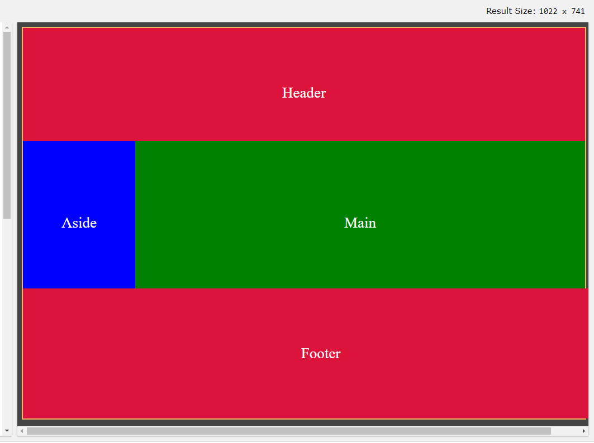
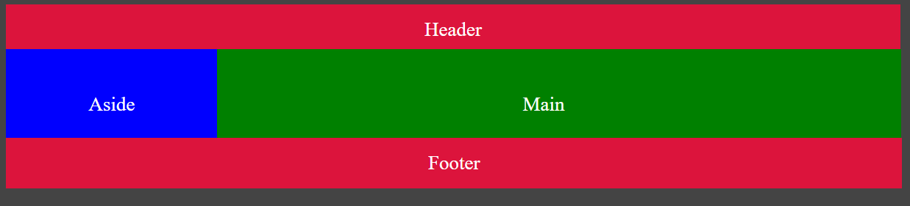
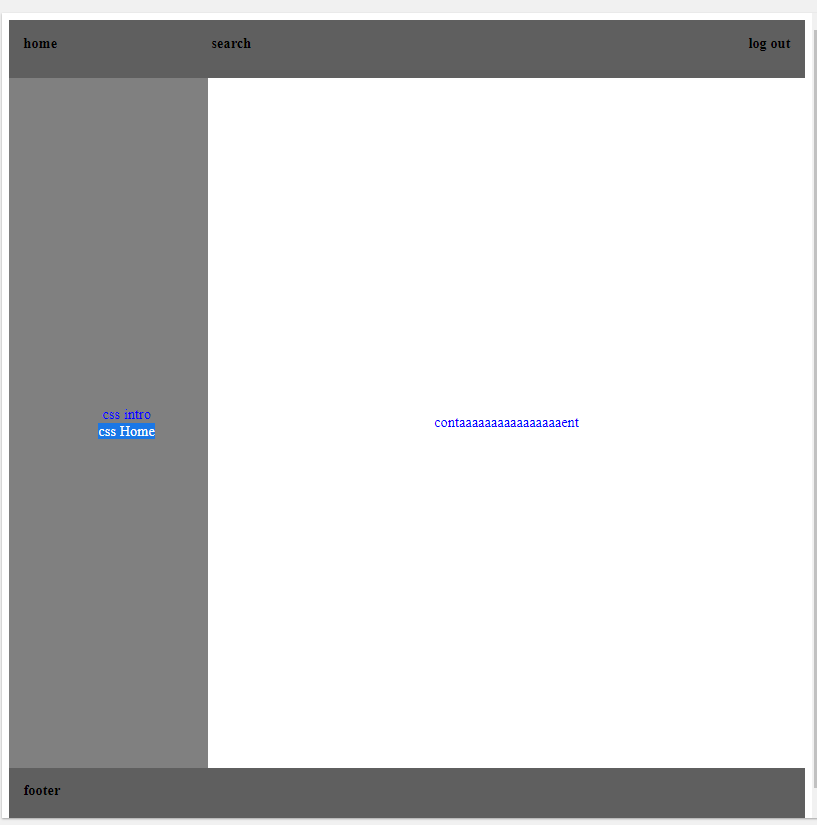

# first thing:
* Grid = layout first while Flexbox = text-first or content first
* grid-template-columns: fr   = ( responsive)
* grid-template-columns: px = (unresponsive)


```html

<!DOCTYPE html>
<html>
<head>
<title>Page Title</title>
<style>

body {
 margin: 0;
}
.container {
  display: grid;
  grid-template-rows: 50px 500px 50px;
  grid-template-columns: 1fr 2fr;
  grid-template-areas: 
  "hd hd hd hd"
  "sd main main main"
  "ft ft ft ft";  
}

.box {
  background-color: green;

}

.header {
  background-color: #00ffcc;
  grid-area: hd;
  display: flex;
  border-bottom: 2px solid gray; 
  
}

.header div {
   width: 200px;   
}


#right {
  margin-left: auto;
}

.side {
 background-color: gray;
 grid-area: sd;
 pdding: 10px;
 display: flex;
 flex-direction: column;
 flex-wrap: wrap;
 font-size: 40px;
 align-items: center;
 justify-content: center;
}

.main {
  grid-area: main;
  font-size: 40px;
}

.footer {
  grid-area: ft;
  background-color:  #00ffcc;
}

a {
  text-decoration: none;
  color: black;  
  font-size: 20px;
}
</style>
</head>
<body>

<div class="container">

<div class="header box">
<a href="#"><div>Home</div></a>
<a href="#"><div>Search</div></a>
<a href="#"  id="right"><div>login</div></a>
</div>

<div class="side box"><div>helloworldhelloworldhelrlde</div><div>aside</div></div>
<div class="main box">Main </div>
<div class="footer box">Footer </div>
</div>

</body>
</html>

```


# grid-flexbox
grid and flex box example 

# layout1:


# layout2:


# layout3:


# layout4:


# top notes:

*  repeat(4, fr) (Create 4 same size columns or row you can use pixels "4 = numbers of elemnts you had"
*  grid-auto-rows: minmax(100px, auto)(Faceback timline or Unkown rows) it replace reapte don't forget:
minmax (100px, auto) = the min size = 100px the max size = auto (the size of content even if 9999px)

* use with grid-template-rows: 1fr 1fr (better)


# final
if we have 12 cells so if we used grid-row: 1 / 3; it will have 4 cells from our 12
if we use it like this 2/4  it will have 6  order come after grid-row

```html

.layout {
  display: grid;
  grid-template-columns: 1fr 1fr 1fr;
  // same as:
  // grid-template-columns: repeat(3, 1fr);
  grid-gap: 8px;
}
.child {
  min-height: 100px;
  background: orange;
  line-height: 100px;
  text-align: center;
}

```


second:

```html
.layout {
  display: grid;
  grid-template-columns: 1fr 1fr;
  grid-gap: 8px;
}
.child {
  background: orange;
  text-align: center;
  padding: 25px;
  
  display: flex;
  justify-content: space-between;
}
.last-row {
  grid-column: 1 / 3;
}

```


## Important example (Helpful)

It don't care xd top header but it must be in grid-area

```html
  grid-template: [header-left] "xd xd" 30px [header-right]
                 [main-left]   "nav  main" 1fr  [main-right]
                 [footer-left] "foot  foot" 30px [footer-right]
                 / 120px 1fr;
 /* try change foot foot to nav foot */
header {
  background-color: lime;
  grid-area: xd;
}

nav {
  background-color: lightblue;
  grid-area: nav;
}

main {
  background-color: yellow;
  grid-area: main;
}

footer {
  background-color: red;
  grid-area: foot;  
}


```

```html

grid-template-rows: repeat(12, 100px);
or
grid-template-rows: repeat(auto, 100px);

```

# Grid Gift:

```css
    grid-template: 

      "hd hd hd hd" 300px
      "sd main main main" 300px
      "ft ft ft ft" 100px 
      /  100px auto 200px;
  }
```


```css
.item-a {
  grid-column-start: 2;
  grid-column-end: five;
  grid-row-start: row1-start;
  grid-row-end: 3;
}
```


# Help ful links:
https://css-tricks.com/snippets/css/complete-guide-grid/
